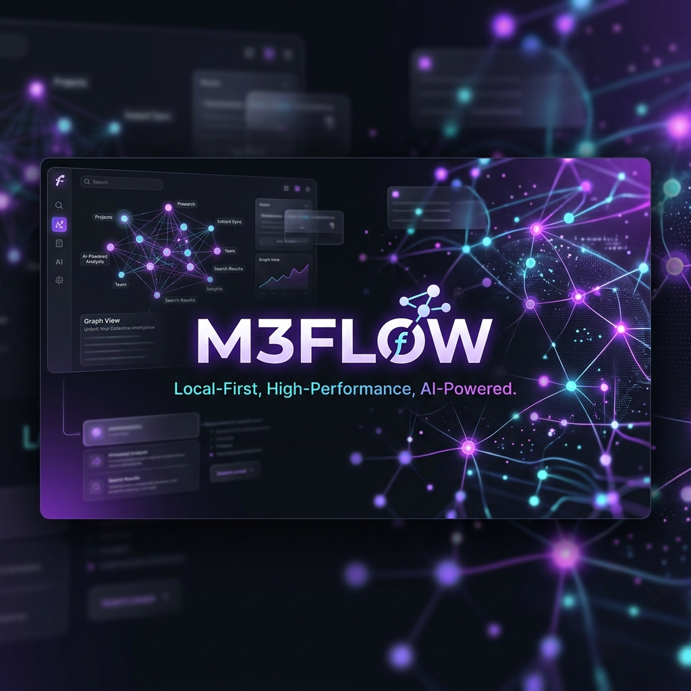

<p align="center">
  
</p>

<h1 align="center">🚀 M3Flow</h1>

<p align="center">
  <strong>The High-Performance, Local-First Knowledge Vault</strong>
</p>

<p align="center">
  <a href="https://github.com/Mortymerio/M3Flow/releases">
    
  </a>
  <a href="https://github.com/Mortymerio/M3Flow/blob/main/LICENSE">
    
  </a>
  
  
  
  
</p>

<p align="center">
  M3Flow is a high-performance writing platform designed for mental clarity and constant creative flow. Unlike other editors, M3Flow lives on your machine, flies with SQLite, and adapts to your visual style through a next-generation reactive theme engine.
</p>

---

<details>
  <summary><b>Table of Contents</b> (Click to expand)</summary>
  
- [🔥 What's New (Update 0.1.17)](#-whats-new-this-version-update-0117)
- [🔥 What's New (Update 0.1.16)](#-whats-new-this-version-update-0116)
- [🔥 What's New (Update 0.1.15)](#-whats-new-this-version-update-0115)
- [✨ Core Features](#-core-features)
- [🛡️ Architecture and Fallbacks](#-resilient-architecture-and-fallbacks)
- [📝 Editing Engines](#-dual-editing-engines)
- [🚀 Quick Start Guide](#-quick-start-guide-for-developers)
- [⌨️ Key Commands](#-key-commands)
- [🤖 Artificial Intelligence](#-artificial-intelligence-your-powered-digital-brain)
- [👤 Credits](#-credits-and-vision)
</details>

---

## 🔥 What's New this Version (Update 0.1.17)

### 🎓 M3Synthesis: Advanced Writing Assistant for Non-Fiction
- **🧠 Asistente de Escritura:** Introduced a new dedicated studio menu for technical and academic writing.
- **⚖️ Socratic Dialectic:** Engaging AI as a "Devil's Advocate" to challenge logic and strengthen treatises.
- **🖇️ Logic Hierarchy:** Real-time conceptual flow analysis to ensure complex ideas have the necessary foundation.
- **📚 Taxonomy Auto-Extractor:** Automatic identification and definition of technical terms to maintain a consistent glossary.
- **🧪 Contextual Source Synthesis:** Advanced drafting that pulls relevant snippets from your entire `@vault` to support your current chapter.

---

## 🔥 What's New in Previous Version (Update 0.1.16)

## 🔥 What's New in Previous Version (Update 0.1.15)

### 🧜‍♂️ Advanced Mermaid Rendering Engine & DOM Integrity
We spent the entire day deep-diving into React's reconciliation engine to build a bulletproof Mermaid diagram rendering pipeline. 
- **Zero-Flicker Architecture:** We isolated the Markdown Preview component using `React.memo` to completely stop "DOM tearing." Moving the cursor or typing in the RAW editor no longer causes Mermaid SVGs to flash or revert to raw text. React now perfectly respects our manually injected diagrams.
- **Robust Token Serialization:** Completely rewrote the `mermaid-markdown.ts` parsing logic. The parser now uses a hardened regex-based token extraction system (`@@M3FLOW_MERMAID_BLOCK@@`) that survives BlockNote's internal data transformations.
- **Block Protection:** Added automatic double-newline padding during pre-processing to guarantee the WYSIWYG editor treats Mermaid diagrams as isolated paragraphs, preventing them from fusing with adjacent text.
- **Corruption Guards:** Implemented a visual `loadError` fallback UI for the Rich Editor. If malformed data is detected during state synchronization, the editor elegantly catches the exception instead of crashing the entire application.
- **Type Safety:** Hardened the payload readers to handle both `InlineItem` arrays and plain strings, completely eliminating the notorious `content.map is not a function` crash when switching from RICH to RAW.


## ✨ Core Features

| Feature | Detail |
| :--- | :--- |
| **🏠 Local-First** | Full privacy. Local SQLite with enterprise-grade performance. |
| **🔄 Dynamic Contexts** | Organize your brain into Notebooks with AI configurations and custom views. |
| **🤖 AI & Vault** | Side chat with `@vault` commands to extract semantic context from your local notes. |
| **🔄 Dual Mode** | Swap between a WYSIWYG Editor (BlockNote) and a RAW Editor (CodeMirror). |
| **⌨️ Power Users** | Deep support for **VIM** and **Emacs** modes in the RAW editor. |
| **🎨 Customization** | 20+ dynamic themes (VS Code Style) and universal font scaling. |

---

## 🛠️ Architecture and Tech Stack

M3Flow is built under the *Local-First* philosophy, ensuring the software is incredibly fast, private, and fault-tolerant.

### 🧠 Core and Database
- **Framework & Interface:** `React 19` + `Vite` + `Tailwind CSS 4`.
- **Persistence (Backend):** `Better-SQLite3`. The heart of the system for instant searches across thousands of notes.
- **Synchronization:** GitHub Trees API with YAML metadata injection (id, title, notebookId, status).

### 🛡️ Resilient Architecture and Fallbacks
M3Flow is designed to be virtually indestructible regarding data integrity:
- **Survival Mode:** If the `userData` folder is inaccessible, the app automatically redirects persistence to a secure local location.
- **Atomic Integrity (WAL Mode):** SQLite configured with **Write-Ahead Logging** to prevent data corruption during failures.
- **Fault-Tolerant Sync:** The backup engine operates asynchronously and isolated from the main thread.

### 📝 Dual Editing Engines
- **RAW Editor (`CodeMirror 6`):** Absolute control, pure Markdown syntax, and terminal shortcuts.
- **RICH Editor (`BlockNote`):** Block-based WYSIWYG experience, ideal for rapid visual structuring.

---

## 🚀 Quick Start Guide for Developers

### 1. Prepare the Environment
```bash
# Install dependencies
npm install

# Configure Electron native binaries
npm run postinstall
```

### 2. Launch in Development
```bash
npm run dev
```

### 3. Build & Packaging
```bash
npm run build
```

---

## ⌨️ Key Commands

- `Ctrl + P`: Open global note search (FTS5).
- `Ctrl + N`: Create new note.
- `Ctrl + B`: Toggle Sidebar.
- `Ctrl + F`: Search within the current note.

---

## 🤖 Artificial Intelligence: Your Powered Digital Brain

M3Flow integrates AI not as a simple plugin, but as a deep extension of your own knowledge base. Our architecture is designed to maximize the utility of LLMs without compromising your privacy.

### 📂 The Achievement: @vault & Dynamic Contexts (Evolved RAG)
M3Flow's most powerful feature is how it combines the **`@vault`** command with **Dynamic Contexts**:

- **Thematic Vaults**: Unlike a generic AI, M3Flow allows defining **Context Prompts** for each Notebook. This means if you are in your "Programming" notebook, the AI already knows it should respond with code and technical documentation, while in "Creative Writing" it will focus on style and narrative.
- **Local Semantic Search (RAG)**: M3Flow uses the SQLite FTS5 engine for instant information retrieval. When invoking `@vault`, the system not only searches through all your notes but prioritizes knowledge from the **active Notebook**, injecting that specialized context into the model.
- **Working Memory**: Each notebook acts as a curated knowledge silo. The AI doesn't just "read" your notes; it "reasons" within the conceptual framework you've defined for that specific project.
- **Absolute Privacy**: All context processing (filtering, ranking, and fragment selection) occurs locally. Your data is never sent for training; it's only used to answer you in the moment.

### 🔌 BYOM (Bring Your Own Model) Philosophy
M3Flow is an agnostic orchestrator that lets you choose the brain you prefer:

- **Cloud Providers**: Connect with **OpenAI (GPT-4o)**, **Anthropic (Claude 3.5)**, **Google Gemini**, or **DeepSeek**.
- **Total Privacy with Ollama**: Run local models and keep your data 100% offline.
- **Embedded Models (WebLLM)**: Leverage your hardware's GPU acceleration to run models directly without external dependencies.

### ✨ Power Examples
> *"@vault Analyze the contradictions between my notes for this project and external references."*

> *"Act according to the context of this notebook (@vault) and draft the introduction for the technical document."*

---

## 👤 Credits and Vision

Designed and developed by **Mariano**.
*M3Flow was born from the need for a tool that doesn't just store text, but facilitates structured thinking without external distractions or network latency.*

---

## 📄 License

This project is open-source under the **MIT** license.
